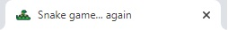
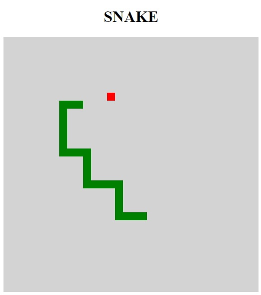

# Snake it... Again...

Este é o famoso jogo da cobrinha. 

Caso não conheça é muito simples: 
- Controle a cobrinha usando as setas do teclado: [↑] [↓] [→] [←]
- Cada vez que ela "come" uma fruta aumenta + 1 de temanho
- As paredes são infinitas, então não se preocupe em bater nelas
- Game over acontece quando você bate no proprio corpo
- Quantos pontos será que consegue fazer ?
- Caso precise reiniciar o jogo, basta reiniciar a pagina

### Quais habilidades e funções foram utilizadas para realizar este projeto?

- [x] html
- [x] css
- [x] javaScript

### Observações:

Este projeto foi feito durante uma aula da Digital Innovation One 
junto com a professora Gabriela Pinheiro.
E eu particularmente gostei muito da didatica e do desenvolvimento
dente projeto. 

mas fiquei na duvida se gostei mais de codar ou de jogar.